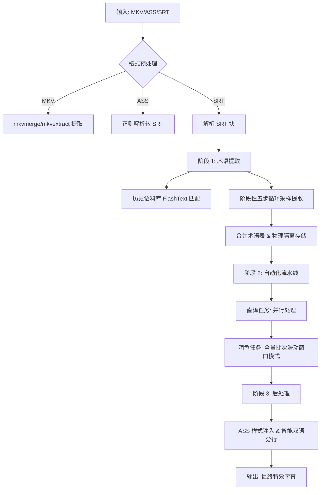

# 🛠️ CLI 自动化翻译：实现原理与架构解析

本项目不仅是一个脚本，它将 **Translate Principle** 的“4+1 步法”沉淀为了一套可扩展的自动化流水线。本文将深入探讨其背后的架构设计。

---

## 🎨 总体工作流 (Architecture)

CLI 版本的核心是将繁琐的网页交互转化为“生产线模型”。以下是处理一个视频文件的标准全生命周期：

---

## 核心技术深度解析

### 1. 深度采样提取 (Deep Cyclic Sampling)
为了解决 AI 预读全文时可能遗漏术语的问题，我们采用了 **五步循环采样法**：
- **全覆盖采样**：脚本分 5 次扫描全文，每次起点偏移 1 行（第一轮取 1,6,11...；第二轮取 2,7,12...），确保视频中的每一行原文都被 LLM 预读并有机会提取术语。
- **物理隔离存储**：新发现的术语会存入独立的 `llm_discovery.db`。加载时系统会先读发现库，后读精校库（`glossary_cache.db`），利用覆盖机制确保你的人工校对数据拥有绝对优先级。可通过 `.env` 开关完全禁用此持久化功能。

### 2. 全量批次滑动窗口 (Full Batch Sliding Window)
字幕翻译最大的挑战是**指代不明**。我们将上下文注入机制优化为“批次对齐”模式：

| 窗口部分 | 内容 | 作用 |
| :--- | :--- | :--- |
| **Previous Context** | **上一个批次的完整翻译结果** (8行) | 提供已确定的叙事风格和指代关系。 |
| **Current Batch** | 当前正在翻译的 8 行字幕 | 核心处理单元。 |
| **Future Context** | **下一个批次的完整原文内容** (8行) | **预知未来**，防止 AI 因为不知道后续剧情而产生逻辑冲突。 |

> **原理**：LLM 在润色时会看到整整 3 个批次（约 24 行）的语境，这使得它能够像人类一样理解剧情。

### 3. 并行与串行的平衡 (Parallel vs. Sequential)
- **直译阶段 (Literal)**：由于不严重依赖上下文，我们使用 `asyncio` 开启**多并发并行请求**。这是提升速度的关键，1 小时的视频通常能在 10 分钟内完成直译。
- **润色阶段 (Polish)**：必须**严格串行**。因为它依赖于“上文”的翻译结果。虽然速度稍慢，但极大地提升了文学性。

### 4. ASS 智能渲染引擎
后处理脚本不仅是简单的转换，它包含了一套精简的渲染逻辑：
- **智能分行**：自动识别原文中的换行符和中英分界，确保在播放器中，中文在上，英文在下。
- **样式注入**：从 `asshead.txt` 中读取预设样式。通过 `MarginV`（垂直边距）的精细计算，让双语字幕在屏幕上排列得错落有致。

---

## 📂 模块职责说明

- `main.py`: 总调度官，负责流程串联。
- `translate_srt_llm.py`: 翻译逻辑核心，控制进度与缓存。
- `core/translation_pipeline.py`: 定义“直译”与“润色”的底层函数。
- `core/glossary_manager.py`: 负责语料库检索与术语提取。
- `pre-process/`: 负责处理 MKVToolNix 相关的底层提取。
- `post-process/`: 负责 SRT 到 ASS 的转换与样式渲染。

---
*你可以回到 [subtitle/README.md](subtitle/README.md) 查看具体的安装与运行步骤。*
